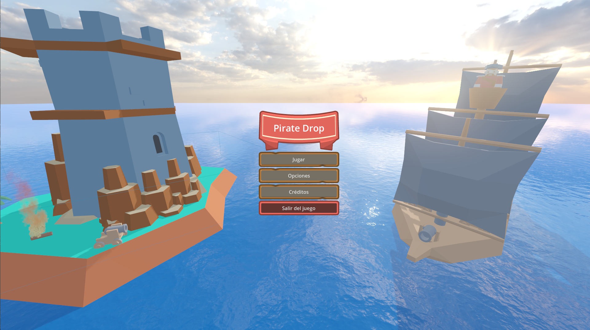
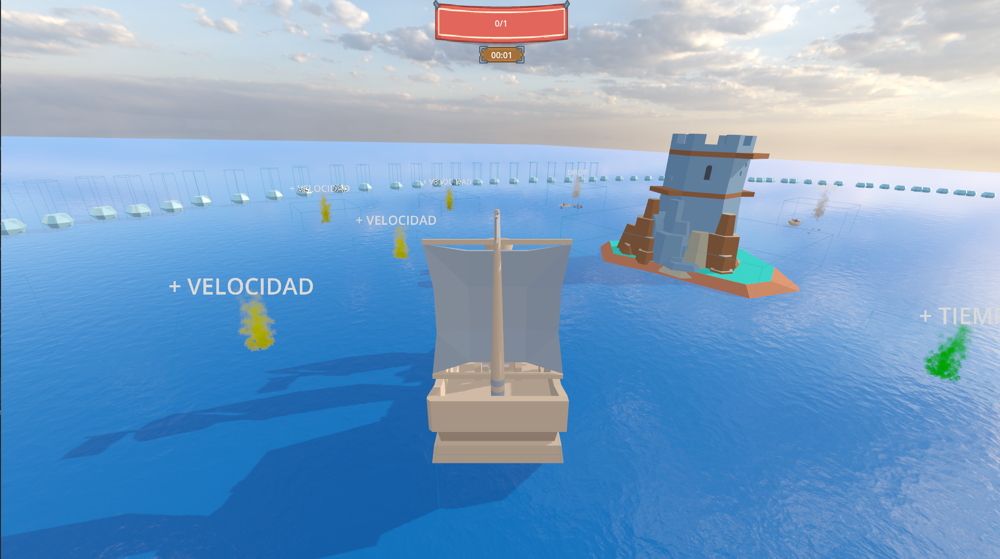
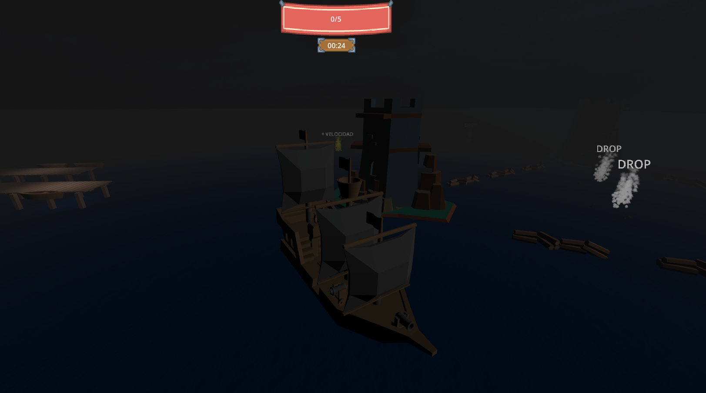

# Pirate Drop

Juego realizado en [Godot](https://godotengine.org/), para el curso de especialización de [Image Campus](https://www.imagecampus.edu.ar/desarrollo-de-videojuegos-con-godot) 

## Concepto:

Sos un barco pirata que tiene que rescatar los suministros necesarios para poder pasar de nivel mientras esquiva obstáculos.

Cada nivel posee su tiempo límite y cantidad de objetos para agarrar.

El jugador puede ayudarse de los powerups que están sobre el mapa:

- Velocidad: aumenta la velocidad por un corto periodo de tiempo.
- Tiempo: aumenta el tiempo máximo para que termine el nivel.

Los niveles cuentan con distintos tipos de obstáculos los cuales dificultan el progreso del jugador.

- Piedras y torres: bloquean el avance del barco.
- Algas: ralentizan al barco mientras el mismo esté sobre estas.
- Troncos: bloquean el avance del barco por un corto periodo de tiempo.
​

## Controles:

Se podrá direccionar el barco haciendo uso del teclado y joystick

Teclado:
W y Flecha arriba: avanzar
A y Flecha izquierda: girar izquierda
D y Flecha derecha: girar derecha
​Joystick:
Analógico izquierdo moverá el barco a la dirección deseada
Analógico derecho moverá la cámara del barco en 360 grados

## Assets y sonidos:

### Assets:

- https://kenney.itch.io/kenney-game-assets

### Sonidos:

- https://opengameart.org/content/blackmoor-tides-epic-pirate-battle-theme

- https://opengameart.org/content/forward-operating-base
